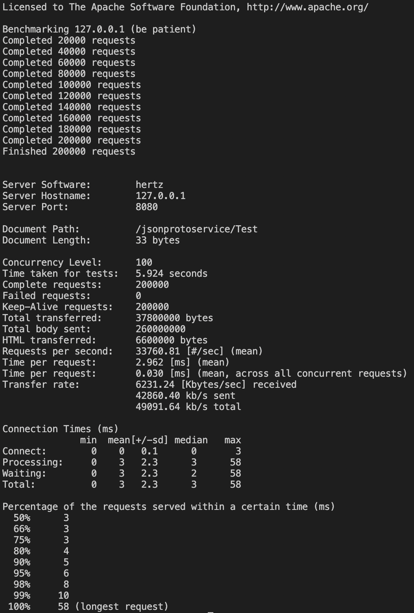

# Orbital API Gateway
This is an implementation of an API gateway that is a single point of entry into a system, built using cloudwego's Hertz and Kitex libraries. It routes requests to appropriate RPC servers simulating microservices, and employs caching and rate limiting strategies.

### Prerequisites
* Golang version 1.14 or newer.
* A proper GOPATH environment.
* [Kitex installed](https://www.cloudwego.io/docs/kitex/getting-started/)
* [Nacos installed](https://nacos.io/en-us/docs/quick-start.html)

Make sure that your Nacos server is running before continuing. 

## Getting Started (API Gateway)
Follow the steps below to set up the API Gateway HTTP server.

### Installation
Clone the repository to your local machine:  
`git clone https://github.com/simbayippy/OrbitalxTiktok.git`

Navigate into the api gateway folder:
`cd OrbitalxTiktok/APIGateway`

Build and run the API Gateway:
`go run .`

## Usage
This API gateway serves as the single entry point into the system, dealing with HTTP requests from the clients, translating them into the appropriate RPC request formats, and forwarding these to the corresponding RPC servers. The response is then returned back to the client.

It supports the following Generic Calls of Kitex:
* JSON Mapping (thrift) Generic Call
* HTTP Mapping Generic Call
* Binary Generic Call

As well as a newly implemented Generic Call feature:
* JSON (protobuf) Generic Call

This API Gateway and RPC servers natively support the newly built jsonproto_codec. In the `go.mod` file, there is the replacement line:
`replace github.com/cloudwego/kitex => github.com/simbayippy/kitex v1.0.0`

For the implementation of my Protobuf codec in the Kitex library, visit [here](https://github.com/simbayippy/kitex)

## Getting Started (RPC servers)
Navigate into the RPC folder:
`cd OrbitalxTiktok/RPCservers`

Currently, 4 types of RPC servers have been built to handle the different Generic Calls:
* JSON Thrift RPC
* HTTP RPC
* Binary RPC

and the new addition:
* JSON proto RPC

## Benchmarking
Benchmarking was done using Apache Bench, on the newly created JSON (Proto) Generic Call

Configuration of benchmark:
* 200000 requests
* concurrency level: 100
* HTTP keep alive enabled: -k flag set

Command used:  
`ab -n 150000 -c 100 -k -p test/postDataProto.json -T 'application/json' http://127.0.0.1:8080/jsonprotoservice/Test`

### Results:
Time per request across all concurrent requests: 0.030ms

    

